# Learn Strands Agent Framework - Hands-On Tutorial

[](https://www.python.org/downloads/)
[](https://strandsagents.com/)
[](https://opensource.org/licenses/Apache-2.0)

> **Learn by Building**: Master the Strands Agent Framework through 10 comprehensive, hands-on lessons covering everything from basics to production deployment.

## 🎯 What You'll Learn

Master the **Strands Agent Framework** through **10 progressive lessons** teaching **production-ready agent patterns** used by leading AI companies.

### Your Learning Journey (25-30 hours)

```mermaid
%%{init: {'theme':'base', 'themeVariables': { 'primaryColor':'#10b981','primaryTextColor':'#fff','primaryBorderColor':'#059669','lineColor':'#6366f1','secondaryColor':'#8b5cf6','tertiaryColor':'#ec4899'}}}%%
graph LR
    A["🌱 Foundation<br/><b>Lessons 1-3</b><br/><i>3-4 hrs</i>"] --> B["🔧 Intermediate<br/><b>Lessons 4-5</b><br/><i>5-6 hrs</i>"]
    B --> C["🚀 Advanced<br/><b>Lessons 6-7</b><br/><i>6-7 hrs</i>"]
    C --> D["💫 Multi-Agent<br/><b>Lessons 8-9</b><br/><i>10-12 hrs</i>"]
    D --> E["🏭 Production<br/><b>Lesson 10</b><br/><i>6-7 hrs</i>"]

    A -.-> A1["• Basic Conversational<br/>• Tool-Enhanced"]
    B -.-> B1["• State & Sessions<br/>• Async Streaming<br/>• Multi-modal"]
    C -.-> C1["• Hooks & Output<br/>• Context-Aware Tools<br/>• Conversation Mgmt"]
    D -.-> D1["• Graph, Swarm, Workflow<br/>• Agents-as-Tools<br/>• A2A Protocol"]
    E -.-> E1["• Guardrails & PII<br/>• Observability<br/>• Testing"]

    style A fill:#10b981,stroke:#059669,stroke-width:3px,color:#fff
    style B fill:#3b82f6,stroke:#2563eb,stroke-width:3px,color:#fff
    style C fill:#8b5cf6,stroke:#7c3aed,stroke-width:3px,color:#fff
    style D fill:#ec4899,stroke:#db2777,stroke-width:3px,color:#fff
    style E fill:#f59e0b,stroke:#d97706,stroke-width:3px,color:#fff
    style A1 fill:#d1fae5,stroke:#059669,stroke-width:2px,color:#065f46
    style B1 fill:#dbeafe,stroke:#2563eb,stroke-width:2px,color:#1e40af
    style C1 fill:#ede9fe,stroke:#7c3aed,stroke-width:2px,color:#6b21a8
    style D1 fill:#fce7f3,stroke:#db2777,stroke-width:2px,color:#9f1239
    style E1 fill:#fef3c7,stroke:#d97706,stroke-width:2px,color:#92400e
```



**What you'll build:** Simple chatbots → Tool-using agents → Stateful systems → Multi-agent teams → Production applications

Each lesson teaches distinct architectural patterns with working code you can run, modify, and build upon.

## ✨ Features

- 🚀 **10 Comprehensive Lessons** - Complete coverage of Strands SDK
- 🛠️ **Hands-On Approach** - Working code you can run immediately
- 📋 **Clear Success Criteria** - Know when you've mastered each concept
- 🔬 **Built-in Experiments** - Explore and modify examples
- 📚 **Complete Documentation** - Detailed explanations and troubleshooting
- 🏗️ **Production-Ready Patterns** - Safety, security, and observability
- ⚡ **Modern Setup** - Uses `uv` for fast Python package management

## 🏃‍♂️ Quick Start

### Prerequisites

- **Python 3.10+**
- **uv** package manager ([install guide](https://docs.astral.sh/uv/))
- **AI Model API Key** - Choose one:
  - **OpenAI** ([get key](https://platform.openai.com/api-keys)) - Recommended
  - **Anthropic** ([get key](https://console.anthropic.com/)) - Alternative
  - **Google Gemini** ([get key](https://aistudio.google.com/app/apikey)) - Alternative
  - **AWS Bedrock** ([setup guide](https://docs.aws.amazon.com/bedrock/latest/userguide/setting-up.html)) - Enterprise
  - **Ollama** (local, free) - For advanced users
- Basic understanding of Python async/await and decorators

### Get Started in 4 Steps

#### Step 1: Clone the Repository
```bash
git clone https://github.com/jztan/strands-agents-learning.git
cd strands-agents-learning
```

#### Step 2: Install Dependencies
```bash
# Install all dependencies
uv sync

# ONE-TIME: Install Jupyter kernel (required for notebooks)
uv run python -m ipykernel install --user \
  --name=strands-learning \
  --display-name="Python (Strands)"
```

#### Step 3: Configure API Key
```bash
# Copy environment template
cp .env.example .env

# Edit .env and add ONE of the following:
# OPENAI_API_KEY=your_openai_key_here        # ← Recommended
# ANTHROPIC_API_KEY=your_anthropic_key_here  # ← Alternative
# GOOGLE_API_KEY=your_google_key_here        # ← Alternative

# Or configure AWS Bedrock (requires AWS credentials + model access):
# Step 1: Configure AWS credentials
#   aws configure  # Enter AWS Access Key ID and Secret Access Key
# Step 2: Enable model access (one-time)
#   Visit: https://console.aws.amazon.com/bedrock/
#   Go to: Model access (left sidebar)
#   Enable: Amazon Nova Lite model
```

#### Step 4: Run Your First Lesson

**Option A: Jupyter Notebooks** (interactive, recommended)
```bash
# Using Jupyter Notebook
uv run jupyter notebook lesson_01_hello_world.ipynb

# Or using Jupyter Lab (modern interface)
uv run jupyter lab lesson_01_hello_world.ipynb
```

**Option B: Python Scripts** (for reference)
```bash
uv run python lesson_01_hello_world.py
```

✨ **That's it!** You now have a working Strands agent with intelligent provider selection.

### 📓 Why Use Jupyter Notebooks?

Each lesson comes as both a Jupyter notebook (`.ipynb`) and Python script (`.py`). **We recommend notebooks** for learning:
- Run code cell-by-cell to understand each concept
- Experiment and modify inline without editing files
- See outputs immediately
- Add your own notes as markdown cells

Python scripts are provided for reference and production use.
## 📚 Learning Path & Agent Patterns

| Level | Lesson | Agent Pattern | Topics |
|-------|--------|---------------|--------|
| **Foundation** | **Lesson 1: Hello World** ✅ | Basic Conversational | Agent basics, system prompts, sync/async |
| | **Lesson 2: First Tool** ✅ | Tool-Enhanced | @tool decorator, calculator, error handling |
| | **Lesson 3: Multiple Tools** ✅ | Tool-Enhanced | Tool coordination, weather/time/converter |
| **Intermediate** | **Lesson 4: Agent State** ✅ | State & Sessions | agent.state API, FileSessionManager, persistence |
| | **Lesson 5: Async, Executors & MCP** ✅ | Async Streaming, Multi-modal & Integration | Async tools, yield, executors, images, PDFs, MCP |
| **Advanced** | **Lesson 6: Hooks & Output** ✅ | Hooks & Structured | Lifecycle hooks, Pydantic models, logging |
| | **Lesson 7: Advanced Tools** ✅ | Context-Aware | Class-based tools, ToolContext, conversation mgmt |
| **Multi-Agent** | **Lesson 8: Orchestration** ✅ | Graph, Swarm & Workflow | Multi-agent patterns, state sharing |
| | **Lesson 9: Distributed Agents** ✅ | Agents-as-Tools & A2A | Hierarchical agents, cross-platform communication |
| **Production** | **Lesson 10: Production** ✅ | Safety, Observability & Eval | Guardrails, PII redaction, OpenTelemetry, testing |
| **Bonus** | **AWS Deployment** 🚧 | Lambda, EC2, ECS, Bedrock | Serverless, containers, managed AI, IaC |

**Progress: 10/10 lessons complete (100%)** 🎉 • **Each lesson includes:** Learning objectives • Working code • Experiments • Success criteria • Common pitfalls

## 💡 Learning Tips

- **Start Simple**: Begin with Lesson 1, don't skip ahead
- **Run the Code**: Execute every example to see it in action
- **Experiment**: Modify examples and see what happens
- **Use the Experiments Folder**: Try your own variations
- **Debug Thoughtfully**: When things break, understand why

> 🛠️ **Having issues?** Check the [Troubleshooting Guide](TROUBLESHOOTING.md)

## 🤝 Contributing

We welcome contributions! Whether you want to report bugs, suggest improvements, or submit code - we'd love your help.

See [CONTRIBUTING.md](CONTRIBUTING.md) for:
- Development setup and workflow
- Coding standards and best practices
- Testing guidelines
- How to submit pull requests

## 📖 Additional Resources

- **[Strands Documentation](https://strandsagents.com/latest/documentation/docs/)** - Official framework docs
- **[Strands GitHub](https://github.com/strands-agents/sdk-python)** - Source code and issues
- **[How I Built My First Intelligent Agent with the Strands Framework](https://www.thefirstcommit.com/how-i-built-my-first-intelligent-agent-with-the-strands-framework-4cd73fb1cddf)** - A practical walkthrough of building agents (by the author)

## 📄 License

This project is licensed under the Apache License 2.0 - see the [LICENSE](LICENSE) file for details.

---

**[⬆️ Back to Top](#learn-strands-agent-framework---hands-on-tutorial)**